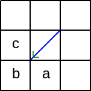

# Introduction

This repository contains a solution to the following interview exam. 
It proposes a valid implementation and its unit test series. 
As such it goes beyond what's effectively asked. 

The push of a solution on a public repository to fuel discussions with the interviewers.
To anyone insterested, feel free to propose updates with a push request.

- Exam
 - Warning
 - Context
 - Objective
- Solution proposal
 - Closed path finding
 - Overlapping detection
 - Area computation
- Solution implementation

# Exam

## Warning

Test Algo FE Senior (english) -  1h

Please note that we do not require a complete working solution in such a short timeframe.

The goal of this test is to see your firsts steps on resolving this test; how you analyse the problem, how you organize your ideas and what are the first steps you take to propose a working solution.
 
## Context

We consider a set of squares arranged in grid, measuring _iMax_ in width and _jMax_ in height. 

Then we compose a maze by using one (and only one) diagonal for each square. Each square  side measures 1 unit, therefore the diagonal length is .

We do use exactly one diagonal for each square. 

The set of these diagonals is use to make groups, or sets. Some sets are closed, other are opened (opened means connected to the 'outside' of the grid).

In this example picture, the given grid has at least 3 closed sets, which areas are 2, 2 and 8. Other sets (not colored) are opened.

    

## Objective

Your goal is to propose, for any given grid following the description above, a method to find:

- the number of closed sets
- the area of the largest closed set

Suggest one (or several) algorithm(s) to address this problem in a game.

(According to the time given, you could suggest the algorithm, provide pseudo-code or real code)

# Solution proposal

## Closed path finding

Definitions :

- A cell is part of a closed path if there is a path starting from this cell and coming back to it in the same direction wuthout having ever reached one of the cells belonging to this path.
- A cell with a diagonal oriented to the right (resp. to the left) is qualified `toRight` (resp. `toLeft`).
- A cell with a diagonal followed in the right or bottom direction is qualified with `progression = true` (simple progression). Other directions give the qualification `progression - false` (simple regression).

Cell study reduction:

- The closed path identification processes each cell from left to right, and each line of cells from top to bottom.
- Because a closed path contains at least one cell `toRight` followed with `progression = true`, it's sufficient to study only such cells as candidates to start a closed path.
- If a cell `toRight` placed in the rightmost column belongs to a closed path, this path have been identified earlier with this cell followed with `progression = false`.
- If a cell `toRight` placed in the last line belongs to a closed path, this path have been identified earlier with this cell followed with `progression = false`.
- The study of a path happens recursively:
 - Only the three cells adjacent to the extremity (depend on the `progression` value) of a cell are studied. Each of these cells can lead to a closed path.
 

    

        Cell `toRight`  
        `progression = true` 
        
    

    

        Cell `toLeft`   
        `progression = true` 
        
    

    

        Cell `toRight`   
        `progression = false` 
        
    

    

        Cell `toLeft`   
        `progression = true` 
        
    

 - An adjacent cell is followed recursively only if no other adjacent cell connectable to this cell belongs to the current path.
 - A closed path is found if one of the adjacent cells is the first cell of the current path, while no other adjacent cell belong to the current path.

Here are few use cases:

    

        
        

            Closed path: YES! 
            The path starting with segment a going clockwise comes back to a via b.
        

    

    

        
        

            Closed path: NO!  
            The path starting with segment a comes back to a from b with the wrong progression (`false` instead of `true`).
        

    

    

        
        

            Closed path: NO! 
            Candidates around the segment b all belong to the current path.
        

    

## Overlapping detection

Not implemented.

In the current implementation, all closed paths are reported.

## Area computation

When a closed path is represented alone in the grid, it's easy to compute the area:

- For each line:
 - For each cell:
   - If the cell has a diagonal then the area value is incremented by one half of a unit.
   - If the cell is empty and the number of cells with a diagonal met on this line is even then the area value is incremented by one unit.

    

The smallest area is composed of four adjacent triangles for a total of two units.

# Solution implementation

The solution can be exercized by opening the [index.html](https://rawgit.com/DomDerrien/interview-exam/master/index.html) file in Chrome, Opera, or Safari.
For now, only these browsers have implemented the EcmaScript 6 `import` statement.
The level of support of other browsers can be checked on [MDN web docs](https://developer.mozilla.org/en-US/docs/Web/JavaScript/Reference/Statements/import) website.

The [index.html](https://rawgit.com/DomDerrien/interview-exam/master/index.html) file contains the glue which renders the grid and the closed paths in the HTML page.
The logic parsing the grid and identifying the closed paths is in the [Grid.js](/lib/Grid.js) file.

By default, the page renders a random distribution in a grid 6x6.
If you want different width and height, append the two numbers separated by an `x` after a `?`.
For example: 

- [index.html?2x2](https://rawgit.com/DomDerrien/interview-exam/master/index.html?2x2), 
- [index.html?9x3](https://rawgit.com/DomDerrien/interview-exam/master/index.html?9x3),
- [index.html?10x10](https://rawgit.com/DomDerrien/interview-exam/master/index.html?10x10).

If you specify [0x0](https://rawgit.com/DomDerrien/interview-exam/master/index.html?0x0), the grid illustrated in the documentation above is repeatedly processed--this is provided to facilitate the debugging ;)

# Acknowlegements

Thank you to [@rawgit](https://twitter.com/rawgit) for offering anyone a [service](https://rawgit.com/) which serves raw file from GitHub with the right headers.

Enjoy!